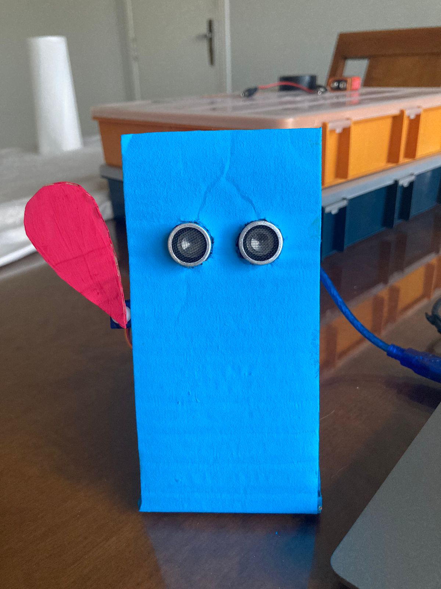

# greeting-robot-arduino

A simple arduino project that uses a ultrassonic sensor to trigger a servo and makes the robot wave back when you wave at it from a certain distance.

The following circuit was implemented:

  

In order to avoid the need for a breadboard, I wired both 5V wires together with an output wire to connect to the arduino 5V pin.

https://user-images.githubusercontent.com/45129483/215599568-4bfc199a-445d-41e8-a0a5-a3ed48b6f823.mp4

  
  
  

